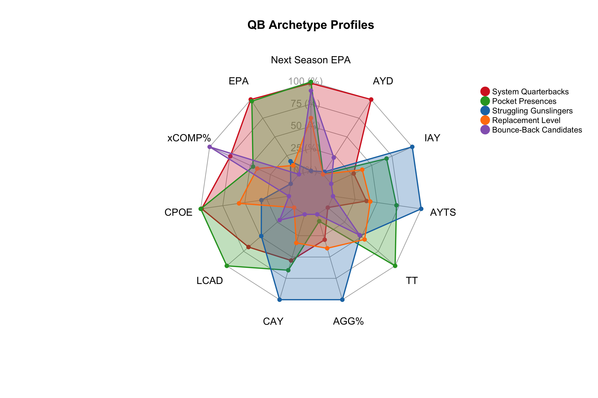
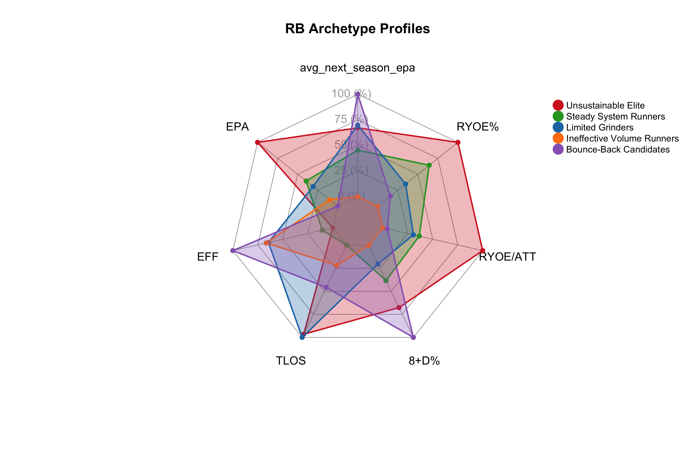
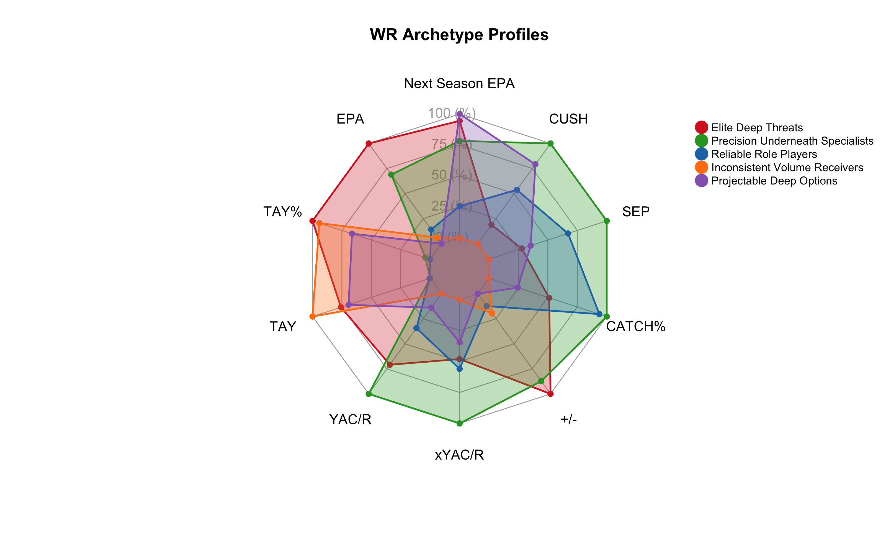

# NFL NextGen Stats Analysis: Player Archetypes and Predictive Modeling

Advanced analytics and predictive modeling framework for NFL talent evaluation using NextGen Stats. Combines player archetype clustering with composite scoring to identify sustainable performance patterns and market inefficiencies.

## Executive Summary

This analysis challenges conventional NFL player evaluation by revealing that **current elite performance doesn't always predict future success**. Using NextGen Stats tracking data, we developed position-specific composite scores and player archetypes that better forecast future performance than traditional metrics.

**Key Findings:**
- **QB Composite Score** achieves **r = 0.347** correlation with next season's EPA
- **Conservative playing styles** are more predictive than aggressive, high-variance approaches  
- **Player archetypes** reveal hidden market inefficiencies in talent evaluation

---

## Research Questions

**Primary:** Which NextGen Stats metrics are most predictive of current and future NFL performance?

**Secondary:**
- Do NGS metrics predict future performance better than traditional stats?
- Which player archetypes show the most sustainable success patterns?
- How can teams identify undervalued talent using advanced metrics?

---

## Methodology

### Four-Phase Analytical Framework

**Phase 1: Exploratory Analysis**
- Distribution analysis and correlation mapping
- Position-specific metric profiling (QB, RB, WR)
- Data quality assessment and outlier detection

**Phase 2: Predictive Modeling**
- Current season correlations (NGS → EPA)
- Future performance prediction (Year N → Year N+1)
- Composite score development weighted by predictive power

**Phase 3: Player Archetype Discovery**
- K-means clustering to identify playing styles
- Performance sustainability analysis
- Market inefficiency identification

**Phase 4: Linear Regression**
- Multi-factor models combining composite scores, current EPA, age, and experience
- Cross-validation and model performance evaluation
- Enhanced prediction accuracy through feature combination

---

## Key Results

### Predictive Power by Position
| Position | Composite Score Correlation | Full Model R² | Top Predictive Metrics |
|----------|----------------------------|---------------|----------------------|
| **QB** | r = 0.347 | R² = 0.23 | Expected Completion %, CPOE, Max Air Distance |
| **WR** | r = 0.206 | R² = 0.054 | YAC Above Expected, Air Yards Share, Catch % |
| **RB** | r = 0.139 | R² = 0.018 | Efficiency, Time to LOS, Rush Yards Over Expected |

### The Predictability Paradox

**QBs:** "Conservative Game Managers" are most predictive despite slightly lower current EPA   
**WRs:** Multiple archetypes can lead to sustained success   
**RBs:** Elite current performance shows massive regression to the mean   

### Key Takeaways
- QB is by far the most predictive position season-over-season
- All three positions reveal archetypes with huge bounce-back potential

---

## Player Archetypes

### Quarterbacks (5 Archetypes)
1. **System Quarterbacks** (31 players): Consistent, efficient execution within offensive framework
2. **Pocket Presences** (18 players): Strong arm talent with patient decision-making
3. **Gunslinger Quarterbacks** (14 players): High-risk, low-reward aggressive approach
4. **Replacement Quarterbacks** (21 players): Limited tools and poor projection
5. **Developing Quarterbacks** (10 players): Significant gap between potential and current execution

### Running Backs (5 Archetypes)
1. **Unsustainable Elite Runners** (9 players): Current peak performers facing major regression risk
2. **Steady System Runners** (32 players): Most predictable, reliable production within scheme
3. **Limited Grinders** (21 players): Consistent but ceiling-capped performance
4. **Ineffective Volume Runners** (21 players): High opportunity, low efficiency execution
5. **Bounce-Back Candidates** (29 players): Buy-low opportunities with bounce-back potential

### Wide Receivers (5 Archetypes)  
1. **Elite Deep Threats** (45 players): Sustained high-level performance on contested targets
2. **Precision Underneath Specialists** (28 players): Consistent efficiency through technical skill
3. **Reliable Role Players** (45 players): Dependable execution without spectacular production
4. **Inconsistent Volume Receivers** (52 players): High opportunity, inconsistent results
5. **Projectable Deep Options** (38 players): Biggest gap between current struggles and future potential

---

## 2024 QB Archetypes & 2025 Predictions

|Player             |2024 Archetype         | Composite Score| 2025 Predicted EPA/Play|
|:------------------|:----------------------|---------------:|-----------------------:|
|Lamar Jackson      |Pocket Presences       |       0.5044403|               0.1805961|
|Jared Goff         |System Quarterbacks    |       1.0191832|               0.1529222|
|Tua Tagovailoa     |Bounce-Back Candidates |       0.7007853|               0.1189970|
|Josh Allen         |Pocket Presences       |      -0.2002721|               0.1121310|
|Matthew Stafford   |System Quarterbacks    |       0.2917297|               0.0949017|
|Patrick Mahomes    |Bounce-Back Candidates |       0.8299725|               0.0896844|
|Jalen Hurts        |Pocket Presences       |       0.5627591|               0.0888481|
|Baker Mayfield     |Bounce-Back Candidates |       0.4613776|               0.0884953|
|Derek Carr         |Pocket Presences       |       0.3693031|               0.0752657|
|Jordan Love        |Pocket Presences       |       0.1367034|               0.0640043|
|Brock Purdy        |Pocket Presences       |       0.0091511|               0.0574989|
|Kyler Murray       |Replacement Level      |       0.1218028|               0.0572774|
|Sam Darnold        |Pocket Presences       |       0.1438259|               0.0568526|
|Aaron Rodgers      |Bounce-Back Candidates |       0.3092810|               0.0557551|
|Joe Burrow         |System Quarterbacks    |       0.6842302|               0.0544268|
|Jayden Daniels     |System Quarterbacks    |       1.1279875|               0.0532169|
|Justin Herbert     |Pocket Presences       |      -0.0112617|               0.0496801|
|Geno Smith         |System Quarterbacks    |       0.7910276|               0.0409423|
|Joe Flacco         |Pocket Presences       |       0.0805755|               0.0258605|
|Justin Fields      |Replacement Level      |      -0.1609163|               0.0199808|
|C.J. Stroud        |Pocket Presences       |       0.0509588|               0.0123419|
|Bo Nix             |Pocket Presences       |       0.9321197|               0.0118314|
|Trevor Lawrence    |Pocket Presences       |      -0.2885023|               0.0095333|
|Kirk Cousins       |System Quarterbacks    |       0.0208737|               0.0058702|
|Jameis Winston     |Struggling Gunslingers |      -0.5529167|               0.0023138|
|Russell Wilson     |Pocket Presences       |      -0.0673244|              -0.0061955|
|Drake Maye         |Replacement Level      |       0.0699275|              -0.0089894|
|Daniel Jones       |System Quarterbacks    |      -0.1296777|              -0.0131135|
|Mac Jones          |Bounce-Back Candidates |      -0.2931318|              -0.0149607|
|Mason Rudolph      |System Quarterbacks    |      -0.3947964|              -0.0159306|
|Dak Prescott       |Replacement Level      |      -0.1956072|              -0.0198653|
|Bryce Young        |Struggling Gunslingers |      -0.8236006|              -0.0329861|
|Caleb Williams     |Pocket Presences       |      -0.1048375|              -0.0379414|
|Gardner Minshew    |System Quarterbacks    |       0.0757731|              -0.0416779|
|Aidan O'Connell    |Replacement Level      |      -0.3530064|              -0.0525222|
|Cooper Rush        |System Quarterbacks    |      -0.3709752|              -0.0621694|
|Anthony Richardson |Struggling Gunslingers |      -1.4534326|              -0.0625721|
|Andy Dalton        |System Quarterbacks    |      -0.2624966|              -0.0674156|
|Deshaun Watson     |Bounce-Back Candidates |      -0.5198855|              -0.0752888|
|Will Levis         |Pocket Presences       |      -0.0943811|              -0.0933866|
|Drew Lock          |Replacement Level      |      -1.0016185|              -0.1043145|
|Jacoby Brissett    |Replacement Level      |      -1.1890079|              -0.1248020|
|Spencer Rattler    |Bounce-Back Candidates |      -0.8261402|              -0.1713098|

*Sorted by 2025 Predicted EPA/Play.*

---

## Strategic Applications

*These metrics serve as valuable complementary tools to enhance existing scouting and evaluation methods, not replace them.*

### Enhanced Draft & Free Agency Evaluation
- **Layer NGS insights** with traditional scouting to identify undervalued prospects
- **Combine composite scores** with film study to validate talent assessments
- **Use archetype patterns** alongside character/culture evaluation for better fit predictions
- **Supplement combine metrics** with predictive NGS profiles for more complete player profiles

### Smarter Contract Negotiations
- **Balance film-based evaluation** with predictive sustainability indicators
- **Combine traditional production metrics** with archetype regression analysis
- **Use NGS data points** to support or challenge conventional valuation approaches
- **Layer predictive modeling** with injury history and age curves for risk assessment

### Advanced Trade Analysis
- **Enhance traditional evaluation** with archetype transition identification
- **Combine team needs assessment** with player projection modeling
- **Use NGS insights** alongside coaching staff input to predict scheme fit
- **Supplement market value analysis** with sustainability and regression indicators

### Integrated Talent Development
- **Pair coaching insights** with archetype-specific development pathways
- **Combine player feedback** with NGS-identified improvement opportunities  
- **Use predictive patterns** alongside traditional development timelines
- **Layer performance projections** with positional coaching expertise

*The goal is to add data-driven layers to proven evaluation methods, creating a more complete picture of player value and potential.*

---

## Technical Implementation

**Languages & Tools:**
- R (tidyverse, cluster analysis, statistical modeling)
- nflfastR package (play-by-play data, NGS data)
- K-means clustering with optimal k selection
- Linear regression with cross-validation

**Data Sources:**
- Play-by-play data (2016-2024)
- NextGen Stats season-level data (2016-2024)

---

## License

MIT License - See LICENSE file for details.

---

*Analysis conducted using R with NextGen Stats data. All code and methodology available in this repository for replication and extension.*
